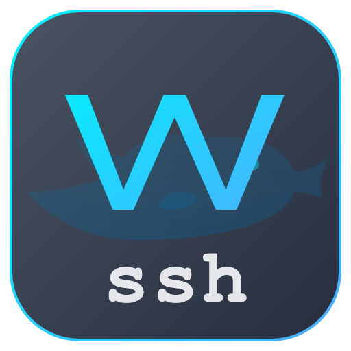

# WhaleSSH

WhaleSSH 是一款基于 Electron 和纯 HTML/CSS/JS 构建的原生风格 macOS SSH 客户端程序。
WhaleSSH is a native-feeling macOS SSH client built using Electron and vanilla HTML/CSS/JS.



## 功能特性 / Features

- **完全免费 (Completely Free)**：开源免费的良心软件，且支持无穷制地保存多个 SSH 连接。 (A truly free software that allows saving multiple concurrent SSH connections without limitations.)
- **OpenClaw 专属伴侣 (OpenClaw Companion)**：具备强大的自定义快捷命令功能，操作 openclaw 再也不用死记硬背枯燥的命令了！ (Features custom snippet commands, making openclaw administration effortless without memorizing complex syntax.)
- **原生风格 UI (Native-feel UI)**：采用无边框设计与悬浮 macOS 交通灯按钮，完美契合 Mac 桌面体验。 (Frameless design with macOS traffic lights for a perfect desktop experience.)
- **多标签页支持 (Multi-Tab Support)**：允许同时建立和管理多个 SSH 连接。 (Establish and manage multiple concurrent SSH connections via tabs.)
- **配置持久化 (Data Persistence)**：主机 IP、端口、SSH 密钥路径、密码自动保存至本地。 (Hosts, ports, keys, and passwords are saved locally.)
- **快捷命令抽屉 (Snippets Drawer)**：支持一键保存常用命令，并一键填充到当前光标处。 (Save frequently used commands and instantly paste them to the active terminal.)
- **自适应终端 (Responsive Terminal)**：集成 `xterm.js` 并全面优化尺寸缩放与滚动问题。 (Integrated `xterm.js` with fully optimized resizing and scrolling.)
- **防断联机制 (Keep-Alive)**：后台自动发送心跳包，确保长连接不断开。 (Automated background heartbeats keep idle connections alive.)

## 安装与运行 / Installation & Usage

确保已安装 Node.js 与 npm。 / Ensure Node.js and npm are installed.

```bash
# 克隆仓库 / Clone the repo
git clone https://github.com/cnLuca0702/WhaleSSH.git
cd WhaleSSH

# 安装依赖 / Install dependencies
npm install

# 启动开发环境 / Start in dev mode
npm start

# 打包为 dmg (Mac 安装包) / Build for macOS (dmg)
npm run build
```

## 技术栈 / Tech Stack
- Electron
- ssh2 (Node.js SSH Client)
- xterm.js (Terminal Emulator)
- electron-store (Local Storage)

## 版权说明 / Copyright
版权所有 © 2026 CUC咨询-YOQ. / Copyright © 2026 CUC Consulting-YOQ.
